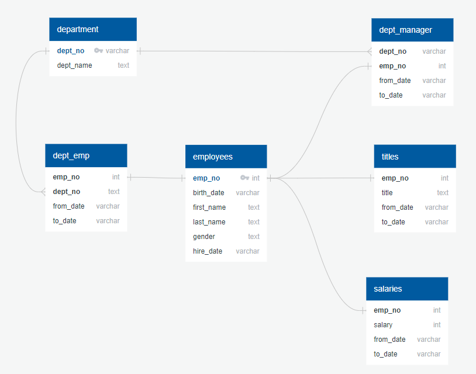

# EmployeeDatabase-SQL
Utilize SQL to create and store CSV data of Employee Information and demostrate how to manipulate said data tables in SQL.  Then, with Python (Jupyter Notebook), illustrate the spread of Employee salary information and compare them to each other.

## Contents
- **DataPlots Output:** Histogram and Barchart outputs from Python Matplotlib analysis
- **data:** Original CSVs of Employee Data
- **DataAnalysis:** SQL file showcasing eight questions answered through data table manipulation.
- **DataEngineering:** SQL file organizing tables and keys of CSV data
- **DataPlots:** Python code importing SQL data to graph
- **ERDImage:** Entity Relational Diagram showcasing how the SQL tables are related

### Data Modeling
The following ERD was sketched with QuickD&D 

