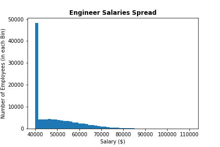
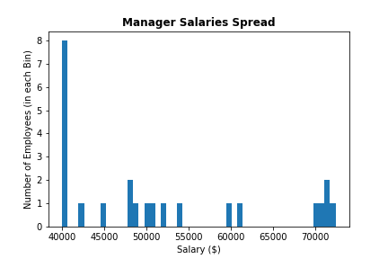
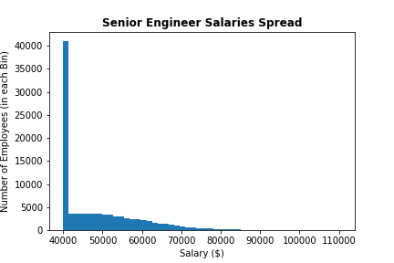
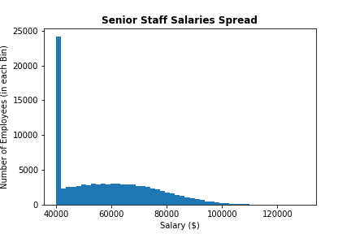
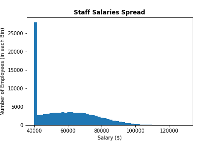
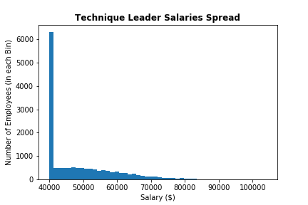

# EmployeeDatabase-SQL Challenge
Utilize SQL to create and store CSV data of Employee Information and demostrate how to manipulate said data tables in SQL.  Then, with Python (Jupyter Notebook), illustrate the spread of Employee salary information and compare them to each other.

## Contents
- **DataPlots Output:** Histogram and Barchart outputs from Python Matplotlib analysis
- **Data:** Original CSVs of Employee Data
- **DataAnalysis:** SQL file showcasing eight questions answered through data table manipulation.
- **DataEngineering:** SQL file organizing tables and keys of CSV data
- **DataPlots:** Python code importing SQL data to graph
- **ERDImage:** Entity Relational Diagram showcasing how the SQL tables are related

### Data Modeling
The following ERD was sketched with QuickD&D 


### Data Engineering
Create tables for all six CSV files with specified data types and keys.

```
CREATE TABLE Department (
	dept_no VARCHAR(10) PRIMARY KEY,
	dept_name VARCHAR(50) NOT NULL
);

CREATE TABLE Employees (
	emp_no INT PRIMARY KEY,
	birth_date DATE(20) NOT NULL,
	first_name VARCHAR(20) NOT NULL,
	last_name VARCHAR(20) NOT NULL,
	gender VARCHAR(5) NOT NULL,
	hire_date DATE(20) NOT NULL
);

CREATE TABLE Salaries (
	emp_no INT NOT NULL,
	FOREIGN KEY (emp_no) REFERENCES Employees(emp_no),
	salary INT NOT NULL,
	from_date DATE(20) NOT NULL,
	to_date DATE(20) NOT NULL
);

CREATE TABLE Titles (
	emp_no INT NOT NULL,
	FOREIGN KEY (emp_no) REFERENCES Employees(emp_no),
	title VARCHAR(50) NOT NULL,
	from_date DATE(20) NOT NULL,
	to_date DATE(20) NOT NULL
);

CREATE TABLE Dept_Emp (
	emp_no INT NOT NULL,
	FOREIGN KEY (emp_no) REFERENCES Employees(emp_no),
	dept_no VARCHAR(10) NOT NULL,
	FOREIGN KEY (dept_no) REFERENCES Department(dept_no),
	from_date DATE(20) NOT NULL,
	to_date DATE(20) NOT NULL
);

CREATE TABLE Dept_Manager (
	dept_no VARCHAR(10) NOT NULL,
	FOREIGN KEY (dept_no) REFERENCES Department(dept_no),
	emp_no INT NOT NULL,
	FOREIGN KEY (emp_no) REFERENCES Employees(emp_no),
	from_date DATE(20) NOT NULL,
	to_date DATE(20) NOT NULL
);
```

### Data Analysis
- Answer the following questions by manipulating the tables in SQL

```
--1. List the following details of each employee: employee number, last name, first name, gender, and salary. 

SELECT Employees.emp_no
	, Employees.last_name
	, Employees.first_name
	, Employees.gender
	, Salaries.salary 
FROM Employees
JOIN Salaries 
	ON Employees.emp_no = Salaries.emp_no;

-- 2. List employees who were hired in 1986. 

-- Change the data types of columns if necessary
ALTER TABLE Employees
ALTER COLUMN hire_date TYPE DATE USING TO_DATE(hire_date, 'YYYY-MM-DD');

SELECT * 
FROM Employees
WHERE EXTRACT(YEAR FROM hire_date) = 1986;

-- Another way to achieve the above
SELECT * 
FROM Employees
WHERE hire_date >= '1986-01-01' AND hire_date < '1987-01-01';

-- 3. List the manager of each department with the following information: 
-- department number, department name, the manager's employee number, 
-- last name, first name, and start and end employment(hire) dates.

SELECT D.dept_no
	, D.dept_name
	, DM.emp_no
	, E.last_name
	, E.first_name
	, DM.from_date
	, E.hire_date 
FROM Department AS D
JOIN Dept_Manager AS DM
	ON D.dept_no = DM.dept_no
JOIN Employees AS E
	ON DM.emp_no = E.emp_no
ORDER BY emp_no ASC;

-- 4. List the department of each employee with the following information: 
-- employee number, last name, first name, and department name.

SELECT E.emp_no
	, E.last_name
	, E.first_name
	, DE.dept_no
FROM Employees AS E
JOIN Dept_Emp AS DE
	ON E.emp_no = DE.emp_no
ORDER BY emp_no ASC;

-- 5. List all employees whose first name is "Hercules" and last names begin with "B."

SELECT * 
FROM Employees
WHERE first_name = 'Hercules' 
	AND last_name LIKE 'B%';

-- 6. List all employees in the Sales department, 
-- including their employee number, last name, first name, and department name.

SELECT E.emp_no
	, E.last_name
	, E.first_name
	, D.dept_name 
	FROM Dept_Emp AS DE			-- Call from the junction between Department and Employees
JOIN Employees AS E
	ON E.emp_no = DE.emp_no
JOIN Department as D
	ON D.dept_no = DE.dept_no
WHERE dept_name = 'Sales';

-- 7. List all employees in the Sales and Development departments, 
-- including their employee number, last name, first name, and department name.

SELECT E.emp_no
	, E.last_name
	, E.first_name
	, D.dept_name
	FROM Dept_Emp AS DE		
JOIN Employees AS E
	ON E.emp_no = DE.emp_no
JOIN Department as D
	ON D.dept_no = DE.dept_no
WHERE dept_name = 'Sales'
	OR dept_name = 'Development';

-- 8. In descending order, list the frequency count of employee last names, i.e., how many employees share each last name.

SELECT last_name
	, COUNT(last_name) AS freq_cnt
FROM Employees
GROUP BY last_name
ORDER BY freq_cnt DESC;
```

### Python Graphing Employee Salaries
Visualize the data by
1. Merging then importing the SQL tables into Pandas
2. Creating a barchart comparing averaged salary of different job titles.
3. Creating histograms of each job title showcasing salary spread.

Salary Barchart, organized from highest to lowest salary.


Salary Range Histograms from each job title.  Notice that an irregularly high number of salaries are around $40,000, suggesting possible falsehood of of the original CSVs.













